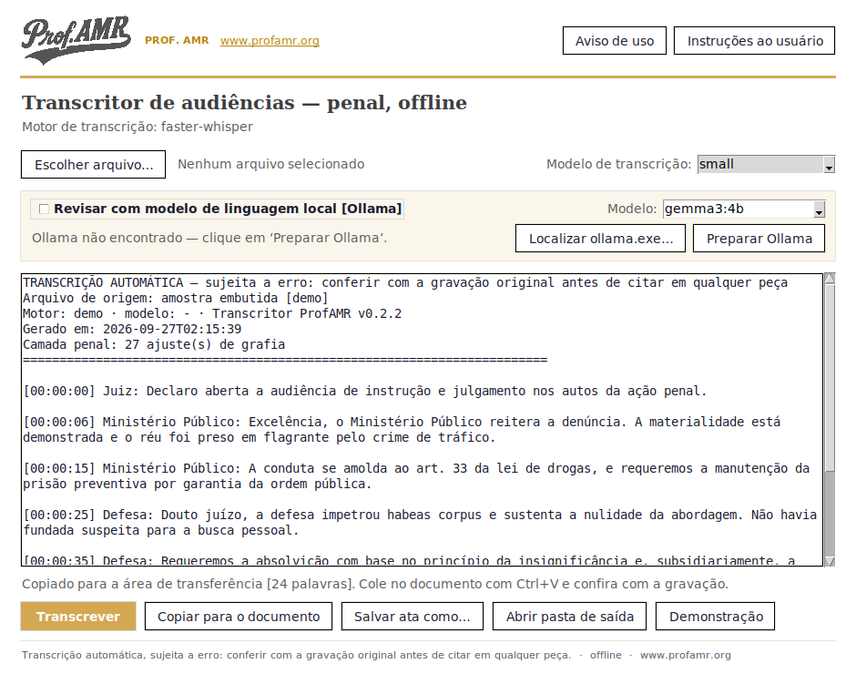

<p align="center">
  
</p>

<p align="center"><sub><b>PROF. AMR</b></sub></p>

# Transcritor ProfAMR 2026

**Transcrição de audiências e depoimentos judiciais em português, 100% offline, com camada especializada em Direito Penal e Processo Penal.**

Ferramenta livre e gratuita para gabinetes, defensorias, promotorias e escritórios. O áudio **nunca sai da máquina** [requisito de sigilo e de conformidade com a LGPD]. Cópia independente inspirada no [TecJustiça Transcribe](https://github.com/marcosmarf27/tecjustica-transcribe-cli) [MIT]. Créditos em [`CREDITOS.md`](CREDITOS.md).

<p align="center"></p>

---

## Baixar e instalar [Windows 10/11, 64 bits]

1. Baixe o **[`TranscritorProfAMR-Windows.zip`](../../releases/latest/download/TranscritorProfAMR-Windows.zip)** na página de **[Releases](../../releases/latest)**.
2. **Descompacte a pasta inteira** [não mova só o executável].
3. Abra **`TranscritorProfAMR.exe`** com duplo clique. O atalho na Área de Trabalho é criado no primeiro uso.
4. Clique em **Escolher arquivo…**, selecione o áudio ou vídeo da audiência e clique em **Transcrever**.
5. Clique em **Copiar para o documento** e cole no voto ou na petição com `Ctrl+V` [sem o cabeçalho técnico; para copiar só um trecho, selecione-o antes].

Na primeira transcrição o modelo Whisper escolhido é baixado uma vez [`small` ≈ 484 MB]; depois o programa roda sem internet. Para máquina sem internet, veja [`MODELOS.md`](MODELOS.md). Passo a passo em [`INSTRUCOES-AO-USUARIO.txt`](dados/INSTRUCOES-AO-USUARIO.txt) [também no botão **Instruções ao usuário** da janela] e no [`tutorial`](docs/TUTORIAL.md).

> **Aviso de uso.** A transcrição é gerada automaticamente e pode conter omissões, palavras trocadas, erros de pontuação e falas atribuídas de forma incorreta. O texto não substitui a gravação audiovisual, fonte oficial do ato. Toda citação em voto, decisão, parecer ou petição deve ser conferida com o áudio ou o vídeo original, no minuto indicado entre colchetes. A responsabilidade pelo conteúdo cabe a quem assina o documento.

### Revisão por modelo local [Ollama, opcional]

Na janela do Transcritor, clique em **Preparar Ollama**. O programa faz o resto:

1. usa o Ollama que já estiver instalado no computador; se não houver, oferece baixar a versão oficial portátil [≈ 1,5 GB, uma vez] para `%USERPROFILE%\TranscritorProfAMR\ollama`;
2. inicia o Ollama em segundo plano;
3. oferece baixar o modelo de revisão `gemma3:4b` [≈ 3,3 GB, uma vez];
4. liga a revisão.

Se o seu Ollama estiver instalado numa pasta incomum, use **Localizar ollama.exe…**. Não é preciso abrir o Ollama: a tela de conta que o `ollama.exe` mostra quando aberto diretamente não é usada pelo Transcritor. Detalhes e links oficiais em [`OLLAMA.md`](OLLAMA.md).

Links oficiais, para quem prefere instalar à mão:

| Opção | Link oficial |
|---|---|
| Windows portátil | [`ollama-windows-amd64.zip`](https://github.com/ollama/ollama/releases/latest/download/ollama-windows-amd64.zip) [≈ 1,46 GB] |
| Windows instalador | [`OllamaSetup.exe`](https://github.com/ollama/ollama/releases/latest/download/OllamaSetup.exe) [≈ 1,57 GB] |
| macOS | [`Ollama.dmg`](https://github.com/ollama/ollama/releases/latest/download/Ollama.dmg) |
| Linux | `curl -fsSL https://ollama.com/install.sh \| sh` |

---

## O que faz

1. **Transcreve** áudio ou vídeo com o faster-whisper [CPU em qualquer computador; GPU NVIDIA quando houver, com retorno automático à CPU se a GPU falhar].
2. **Aplica a camada penal**: corrige a grafia de termos jurídicos e normaliza dispositivos [`artigo 33` → `art. 33`; `parágrafo 4` → `§ 4º`; `parágrafo 10` → `§ 10`, ordinal até o nono e cardinal a partir do décimo, conforme a LC 95/1998, art. 10], por regras editáveis em `dados/`.
3. **Revisa [opcional]** com modelo de linguagem local [Ollama], com trava que recusa a proposta quando o modelo altera números ou o tamanho do trecho.
4. **Exporta** `.txt` [ata], `.srt` [legenda] e `.json` [dados], com **hash SHA-256 do arquivo de origem**, motor, modelo e data no cabeçalho; o `.json` guarda o texto bruto do reconhecimento ao lado do texto final.

### Limites conhecidos

- **Falantes:** o motor de CPU não separa vozes. A ata sai sem atribuição de falante, em vez de atribuir todas as falas a um único papel processual. A separação exige o motor WhisperX [GPU NVIDIA e token do Hugging Face; `TRANSCRITOR_MOTOR=whisperx`].
- **Velocidade:** depende do processador e do modelo. `base` é o mais rápido dos úteis, `small` é o padrão, `medium` é mais preciso e mais lento; `large-v3` só compensa com GPU.
- **Qualidade:** cai com ruído, eco e vozes sobrepostas.

---

## Privacidade

O processamento é local. Nenhum trecho de depoimento sai da máquina. A revisão por modelo usa apenas o Ollama em `localhost`, nunca a nuvem. A transcrição por máquina é apoio de trabalho, não ata oficial com fé pública [a documentação audiovisual dispensa transcrição, que é faculdade do magistrado, conforme a Resolução 105/2010 do Conselho Nacional de Justiça].

---

## Rodar a partir do código [qualquer sistema]

Requer [Python](https://www.python.org/downloads/). No Linux, a janela precisa de `python3-tk`.

```
pip install -e ".[cpu]"                # -e: usa a pasta dados/ do projeto
transcritor-gui                      # janela
transcritor transcrever audiencia.mp4 --modelo small [--llm]
transcritor ollama status
python -m pytest -q tests            # testes
```

Links dos modelos e download manual em [`MODELOS.md`](MODELOS.md).

---

## Versão Tauri [em desenvolvimento]

A subpasta [`app-tauri/`](app-tauri/) traz uma interface desktop em Tauri v2 sobre o mesmo motor Python [sidecar], com instalador nativo. Instruções de build em [`app-tauri/README.md`](app-tauri/README.md). Experimental e sem Release: o pacote oficial é o aplicativo Windows acima.

---

## Licença

[MIT](LICENSE). Livre para usar, modificar e redistribuir, mantendo o aviso de copyright e os créditos.
